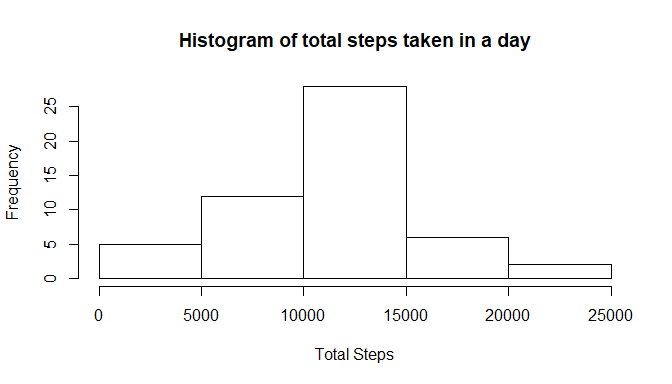
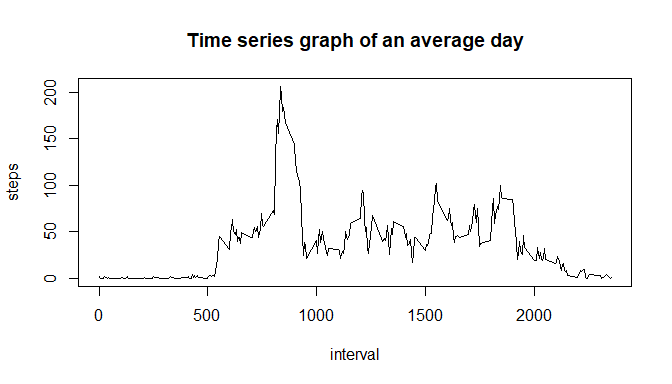
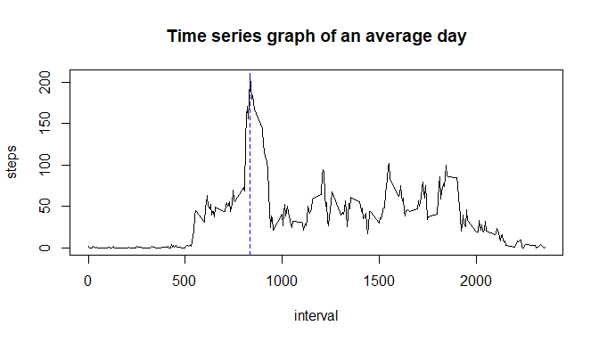
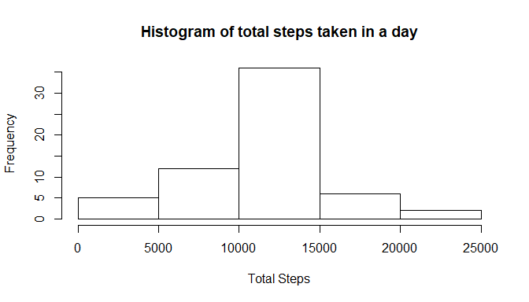
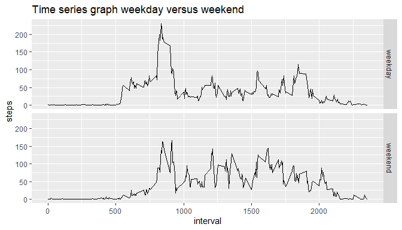

## Loading and preprocessing the data


First the data is loaded, and if needed the zip file is unziped:

```r
if (!file.exists("activity.csv")){
        unzip("activity.zip") 
}
act_data <- read.csv("activity.csv",na.strings = "NA")
act_data$date <- as.Date(act_data$date, format = "%Y-%m-%d")
```

Let's look at the data:

```r
head(act_data)
```

```
##   steps       date interval
## 1    NA 2012-10-01        0
## 2    NA 2012-10-01        5
## 3    NA 2012-10-01       10
## 4    NA 2012-10-01       15
## 5    NA 2012-10-01       20
## 6    NA 2012-10-01       25
```

It looks like January First does contain many NA values


## What is mean total number of steps taken per day?

Calculating the total number of steps taken per day:


```r
total_step_day <- aggregate(steps ~ date,act_data, sum)
head(total_step_day)
```

```
##         date steps
## 1 2012-10-02   126
## 2 2012-10-03 11352
## 3 2012-10-04 12116
## 4 2012-10-05 13294
## 5 2012-10-06 15420
## 6 2012-10-07 11015
```
It is odd that January First doesn't appear in the summed data, but that does seem to correlate with NAs present in the original data.

Let's see a histogram of the data:

<!-- -->

It seems that the majority of days have between ten thousand and fifteen thounsand total steps. 

## What is the average daily activity pattern?

The mean and median values of total number of steps taken per day are:


```r
step_mean <- mean(total_step_day$steps)
step_median <- median(total_step_day$steps)
# The mean is:
step_mean
```

```
## [1] 10766.19
```

```r
# And the median:
step_median
```

```
## [1] 10765
```
So it seems that both the median and the mean value are close to each other.

But let's look at the distribution of steps per interval, on average:

```r
total_step_interval <- aggregate(steps ~ interval,act_data, mean)
plot(total_step_interval, type = "l", main = "Time series graph of an average day")
```

<!-- -->

The interval with the maximum number of steps is:  

```r
total_step_interval$interval[total_step_interval$steps == max(total_step_interval$steps)]
```

```
## [1] 835
```
Therefore, the interval of 5 minutes starting 8:35am is the one that. on average, has the higher number of steps according to the data and in the graph corresponds to that peak.

Highlighting it in blue:

<!-- -->

## Imputing missing values

Let's see how much of the data is missing:


```r
sum(is.na(act_data))
```

```
## [1] 2304
```

So it looks like 2304 rows have NA values.


```r
(mean(is.na(act_data))*100)
```

```
## [1] 4.371585
```

And that amounts to a percentage of 4.37% missing data in the dataset.
### Dealing with the missing values

Since it was suggested the creation of a new dataset, the approach chosen was to input the average value of steps for the interval, when there's a missing value


```r
data_mean_interval <- act_data
for (i in 1:nrow(data_mean_interval)) {
  if (is.na(data_mean_interval$steps[i])) {
    interval_match <- data_mean_interval$interval[i]
    row_match <- total_step_interval[total_step_interval$interval == interval_match,]
    data_mean_interval$steps[i] <- row_match$steps
  }
}
```

Now we can calculate the total number of steps taken per day and see the results:


```r
total_step_day_filled <- aggregate(steps ~ date, data_mean_interval, sum)
head(total_step_day_filled)
```

```
##         date    steps
## 1 2012-10-01 10766.19
## 2 2012-10-02   126.00
## 3 2012-10-03 11352.00
## 4 2012-10-04 12116.00
## 5 2012-10-05 13294.00
## 6 2012-10-06 15420.00
```

Now there are values for January 1st for example, let's see if the histogram has changed as well:


```r
hist(total_step_day_filled$steps, main = "Histogram of total steps taken in a day", xlab = "Total Steps")
```

<!-- -->

Well, it doesn't seem any different in form, but it's visible that the frequency has risen a lot in the values around the mean. 
Let's look if the mean and median values have changed:


```r
step_mean_filled <- mean(total_step_day_filled$steps)
step_median_filled <- median(total_step_day_filled$steps)
# The mean is:
step_mean_filled
```

```
## [1] 10766.19
```

```r
# And the median:
step_median_filled
```

```
## [1] 10766.19
```
Well, both the mean and the median have converged into the value of the first mean that was taken before dealing with the NAs. So, in a way the dataset was filled in such way that there wasn't any divergence towards the mean values.

## Are there differences in activity patterns between weekdays and weekends?

This was the final question proposed in the project, so let's use another time series graph to show what changes between the weekend and the rest of the week:


```r
#using wday to label Sundays and Saturdays as "weekend", and the rest as "weekday"
for (i in 1:nrow(data_mean_interval)) {
        if (wday(data_mean_interval$date[i]) == 1 | wday(data_mean_interval$date[i]) == 7){
                data_mean_interval$day_type[i] <- "weekend"
        }
        else{
                data_mean_interval$day_type[i] <- "weekday"
        }
}

#Defining day_type as a factor so that it can be used to separate the time series graphs
data_mean_interval$day_type <- as.factor(data_mean_interval$day_type)

total_step_interval_filled <- aggregate(steps ~ interval + day_type, data_mean_interval, mean)

qplot(interval, steps ,data = total_step_interval_filled, facets = day_type~., type = "l", geom=c("line"), main = "Time series graph weekday versus weekend")
```

<!-- -->

So based on this graph we can see that the activity during the morning gets "pushed" a little foward, during the weekend, and the activity during the afternoon and night appear to be higher than during the weekdays. 
